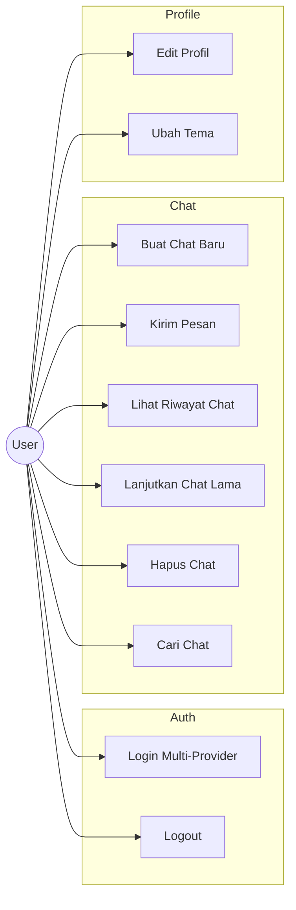
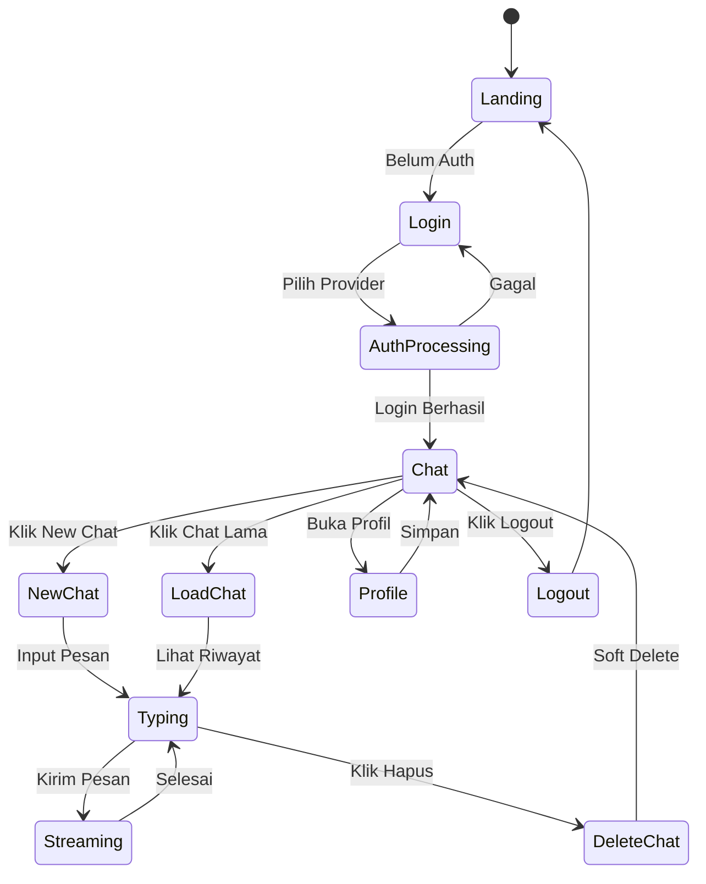
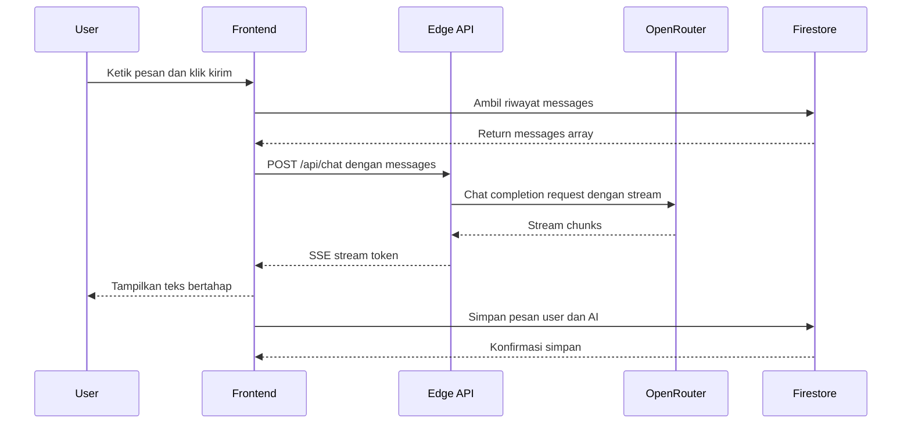
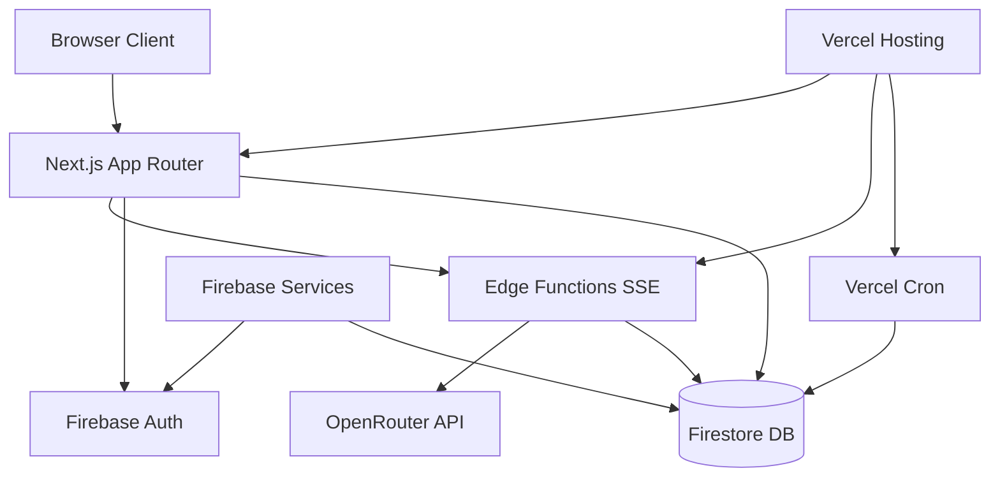
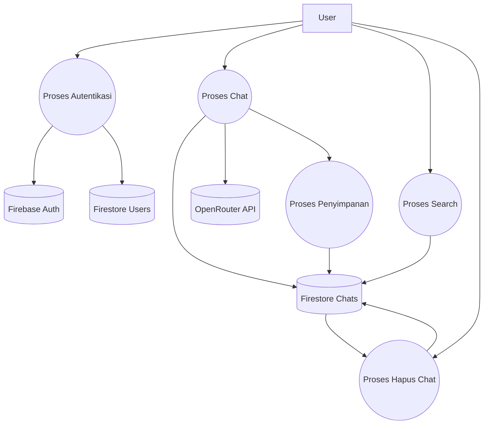
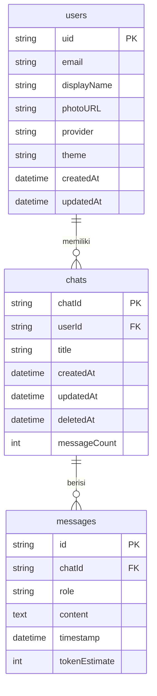

# PRD — ChatBot AI Personal dengan Memori Permanen (OpenRouter + Firebase)

## Assumptions
- API key OpenRouter disediakan oleh developer melalui environment variable (disimpan di Vercel Environment), bukan dimasukkan oleh user.
- Model yang dipakai adalah `ox-alpha` (model stealth di OpenRouter) sesuai brief; diasumsikan dapat diakses lewat endpoint chat completions standar OpenRouter.
- Karena menggunakan **Full History Injection** (semua pesan dikirim setiap request), diasumsikan panjang rata-rata percakapan per user akan tetap dalam batas context window model untuk MVP, dengan fallback pemotongan pesan terlama (FIFO) jika terjadi error context length exceeded.
- Soft delete 30 hari memakai **Cloud Functions for Firebase** dengan trigger harian, atau cron Vercel (terpilih Vercel Cron untuk konsistensi platform). Detail implementasi masuk backlog.
- Search riwayat memakai query sederhana di awal (filter by judul/tanggal di Firestore). Full-text search memakai Algolia/Meilisearch masuk fase **Should Have**.
- Pengguna tidak perlu mengatur API key, model, atau parameter AI; semua dikontrol developer untuk menjaga konsistensi dan keamanan.
- Struktur data `messages` disimpan sebagai array di dalam dokumen `chats` untuk menyederhanakan MVP, dengan pagination jika chat sangat panjang.

---

## 1. Overview

Project ini adalah aplikasi web chatbot AI percakapan yang menyerupai ChatGPT, dengan keunggulan utama berupa **memori jangka panjang** yang permanen. Setiap percakapan disimpan utuh dan disuntikkan kembali ke model AI pada setiap request, sehingga asisten mampu merujuk konteks pembicaraan sebelumnya.

- **Masalah**: Chatbot umum tidak menyimpan konteks antar sesi, sehingga pengguna harus mengulang informasi dan tidak memiliki riwayat personal yang dapat ditelusuri.
- **Solusi**: Platform chatbot web yang menggabungkan OpenRouter API (model stealth `ox-alpha`), Firebase Authentication, dan Firebase Firestore untuk menyimpan seluruh riwayat percakapan, dengan streaming respons real-time melalui Next.js Edge Runtime.
- **Target pengguna**: Individu yang membutuhkan asisten AI untuk produktivitas, belajar, riset, atau eksplorasi AI, dengan akses lintas perangkat (desktop dan mobile).
- **Tujuan utama**:
  1. Menyediakan asisten AI personal dengan memori percakapan permanen.
  2. Streaming respons yang cepat dan responsif.
  3. Akses aman melalui multi-provider authentication.
  4. Pengalaman UI/UX yang bersih, cepat, dan ramah seluler.
- **Nilai utama aplikasi**: Personalisasi, kontinuitas percakapan, transparansi (user dapat melihat dan mengelola seluruh riwayatnya sendiri), serta kemudahan akses tanpa perlu instalasi.

---

## 2. Requirements

- **Aksesibilitas Platform**: Web app, dapat diakses dari browser desktop dan seluler. Deploy di Vercel free plan.
- **Target Pengguna**: End-user individu, usia produktif, familiar dengan chat AI generik (ChatGPT, Claude, dsb.).
- **Role User**:
  - `User` (end-user): signup/login, chat, kelola profil, kelola riwayat, hapus chat.
- **Input Data Utama**:
  - Teks pesan dari user.
  - Kredensial login (email/password atau token provider).
  - Metadata profil (nama, foto, preferensi tampilan).
- **Output Utama**:
  - Respons AI dalam format markdown (streaming).
  - Daftar riwayat percakapan (sidebar).
  - Hasil pencarian riwayat.
- **Kebutuhan Autentikasi**: Firebase Authentication, mendukung GitHub OAuth, Google OAuth, dan Email/Password.
- **Kebutuhan Notifikasi**: Notifikasi toast/inline untuk status (login sukses, error, dsb.). Email notifikasi **Opsional**.
- **Kebutuhan Dashboard/Laporan**: Tidak ada dashboard admin di MVP. Laporan sederhana untuk user (jumlah chat, total pesan) **Opsional**.
- **Kebutuhan Streaming**: Server-Sent Events (SSE) lewat Next.js Edge Runtime untuk respons real-time per token.
- **Batasan MVP**:
  - Tidak ada multi-model switching untuk user.
  - Tidak ada upload file/image di MVP (konten rich hanya render markdown dari teks).
  - Tidak ada collaborative chat (1 user = 1 percakapan).
  - Tidak ada panel admin.

---

## 3. Core Features

### F1. Autentikasi Multi-Provider
- **Fungsi**: Sign up dan login melalui GitHub, Google, atau Email/Password.
- **Input**: Kredensial atau popup OAuth.
- **Output**: Session user aktif, redirect ke halaman chat.
- **Logic**: Firebase Auth handle session; onAuthStateChanged listener di client untuk auto-login/logout.

### F2. Manajemen Profil Pengguna
- **Fungsi**: Melihat dan memperbarui nama tampilan, foto profil (dari provider), dan preferensi tema (light/dark).
- **Input**: Form edit profil.
- **Output**: Update tersimpan di Firestore `users/{uid}`.
- **Logic**: Profil sinkron dari Firebase Auth; data tambahan (preferensi) disimpan di Firestore.

### F3. Sesi Obrolan Baru
- **Fungsi**: Membuat chat baru dengan pesan pembuka.
- **Input**: Klik tombol "New Chat", ketik pesan pertama.
- **Output**: Dokumen baru di Firestore `chats/{chatId}` dengan judul otomatis (dipotong dari pesan pertama, maks 50 char).
- **Logic**: Generate UUID sebagai `chatId`; inisialisasi array `messages` kosong, lalu append pesan user.

### F4. Lanjutkan Percakapan Lama
- **Fungsi**: Membuka chat dari sidebar, konteks dimuat penuh.
- **Input**: Klik item di daftar chat.
- **Output**: Riwayat pesan tampil, siap menerima pesan baru.
- **Logic**: Fetch dokumen `chats/{chatId}`, render pesan, inject seluruh array `messages` ke request OpenRouter.

### F5. Penyimpanan Riwayat Otomatis
- **Fungsi**: Setiap pesan (user & assistant) disimpan real-time.
- **Input**: Pesan baru dari user atau chunk dari AI streaming.
- **Output**: Append/update dokumen Firestore `chats/{chatId}.messages`.
- **Logic**: Debounce update saat streaming (simpan per chunk/akhir stream) untuk efisiensi write.

### F6. Memori Jangka Panjang — Full History Injection
- **Fungsi**: Mengirim seluruh array `messages` ke OpenRouter setiap request.
- **Input**: `messages[]` dari Firestore.
- **Output**: Respons AI yang kontekstual.
- **Logic**: Jika response error 400 (context length exceeded), otomatis pangkas `messages` terlama (FIFO) dan retry sekali.

### F7. Streaming Respons Real-Time (SSE)
- **Fungsi**: Respons AI tampil per token secara progresif.
- **Input**: Pesan user.
- **Output**: Teks yang muncul bertahap di UI.
- **Logic**: Edge Function `app/api/chat/route.ts` dengan `runtime = 'edge'` dan `stream = true`, fetch ke OpenRouter dengan `stream: true`.

### F8. Riwayat Obrolan yang Dapat Dicari
- **Fungsi**: Cari chat berdasarkan judul atau kata kunci.
- **Input**: Query teks di search bar.
- **Output**: Daftar chat yang match.
- **Logic** **(MVP)**: Filter `where('userId', '==', uid)` + scan di client untuk `title`/`messages[].content`. Pencarian lanjutan di fase **Should Have**.

### F9. Antarmuka Responsif
- **Fungsi**: Layout adaptif untuk mobile dan desktop.
- **Input**: Resolusi layar.
- **Output**: Tampilan optimal.
- **Logic**: Tailwind responsive utilities; sidebar collapse jadi drawer di mobile.

### F10. Render Markdown & Syntax Highlighting
- **Fungsi**: Format pesan AI (bold, list, code block) ditampilkan rapi.
- **Input**: String markdown dari AI.
- **Output**: HTML ter-render.
- **Logic**: Pakai `react-markdown` + `remark-gfm` + `rehype-highlight` (Shiki/Prism). Sanitize untuk keamanan.

### F11. Self-Delete Chat (Soft Delete)
- **Fungsi**: User dapat menghapus chat individual; data dihapus permanen setelah 30 hari.
- **Input**: Klik tombol hapus di item chat.
- **Output**: Chat hilang dari sidebar, dokumen di-flag `deletedAt`.
- **Logic**: Set field `deletedAt: timestamp` di Firestore; **Vercel Cron Job** harian query `where('deletedAt', '<=', now - 30d)` lalu hard delete.

### Fitur Tambahan

- **F12 (Opsional) — Rename Chat**: User dapat mengubah judul chat.
- **F13 (Opsional) — Export Chat**: Download riwayat sebagai `.md` atau `.json`.
- **F14 (Opsional) — Token/Cost Estimator**: Estimasi jumlah token per chat.
- **F15 (Opsional) — Stop Generation**: Tombol untuk menghentikan streaming AI.

---

## 4. User Flow & Use Case

### User Flow (End-User)

1. User membuka URL app → jika belum login, redirect ke `/login`.
2. User memilih metode login (GitHub/Google/Email) → Firebase Auth memproses.
3. Setelah login sukses → redirect ke `/chat` (halaman chat kosong / new chat).
4. User mengetik pesan di input box → klik kirim.
5. Sistem membuat dokumen chat baru (jika belum ada) dengan judul dari pesan pertama.
6. Edge Function memproses: fetch full history → kirim ke OpenRouter → stream response.
7. Respons AI tampil bertahap di UI; pesan user & AI disimpan ke Firestore.
8. User dapat mengirim pesan lanjutan, atau klik chat lama di sidebar untuk melanjutkan.
9. User dapat mencari chat di search bar, rename (opsional), atau hapus chat.
10. User dapat membuka `/profile` untuk mengubah nama dan tema.
11. User logout dari menu profil.

### Use Case Diagram



---

## 5. System Diagrams

### Activity Diagram



### Sequence Diagram (Alur Kirim Pesan)



### Architecture Diagram



### Data Flow Diagram (DFD)



---

## 6. Database Schema

### ERD



### Penjelasan Schema

| Tabel / Collection | Field | Tipe | Keterangan |
|---|---|---|---|
| **users** | uid | string (PK) | UID dari Firebase Auth |
| | email | string | Email user |
| | displayName | string | Nama tampilan |
| | photoURL | string | URL foto dari provider |
| | provider | string | `github` / `google` / `email` |
| | theme | string | `light` / `dark` / `system` |
| | createdAt | datetime | Timestamp signup |
| | updatedAt | datetime | Timestamp update profil |
| **chats** | chatId | string (PK) | UUID |
| | userId | string (FK -> users.uid) | Owner chat |
| | title | string | Judul otomatis (potongan pesan pertama) |
| | createdAt | datetime | Timestamp chat dibuat |
| | updatedAt | datetime | Timestamp pesan terakhir |
| | deletedAt | datetime (nullable) | Soft delete timestamp |
| | messageCount | int | Jumlah pesan (untuk sorting cepat) |
| **messages** | id | string (PK) | UUID per message |
| | chatId | string (FK -> chats.chatId) | Induk chat |
| | role | string | `user` / `assistant` / `system` |
| | content | text | Isi pesan (markdown) |
| | timestamp | datetime | Waktu pesan |
| | tokenEstimate | int | Estimasi token (opsional) |

> Catatan: Pada implementasi MVP, `messages` disimpan sebagai **subcollection** dari `chats` agar query dan pagination lebih efisien.

---

## 7. Design & Technical Constraints

### 1. High-Level Technology
- **Framework**: Next.js 14+ (App Router) + TypeScript
- **Runtime**: Edge Runtime untuk endpoint streaming (`/api/chat`)
- **Styling**: Tailwind CSS + shadcn/ui (komponen siap pakai)
- **Auth**: Firebase Authentication (Client SDK)
- **Database**: Firebase Firestore (Client SDK untuk read, Server SDK via Edge terbatas — gunakan REST API atau Admin SDK di Node Function)
- **AI Provider**: OpenRouter API (model `ox-alpha`)
- **Markdown**: `react-markdown` + `remark-gfm` + `rehype-highlight`
- **Cron**: Vercel Cron Jobs untuk purge chat 30 hari
- **Hosting**: Vercel Free Plan
- **Prioritas**: Maintainability, biaya rendah, performa cepat.

### 2. UI/UX Direction
- **Gaya visual**: Minimalis modern, mirip ChatGPT, bersih, banyak whitespace.
- **Layout**:
  - Sidebar kiri: daftar chat + search + tombol "New Chat" + menu profil.
  - Area utama: messages list (scrollable) + input box di bawah.
  - Pada mobile: sidebar jadi drawer (hamburger menu).
- **Komponen penting**:
  - `ChatMessage` (bubble user/AI dengan markdown render)
  - `ChatInput` (textarea auto-resize + tombol kirim + stop button opsional)
  - `Sidebar` (list chat, search, new chat, profile menu)
  - `LoginPage` (tombol GitHub, Google, Email form)
  - `ProfilePage` (form edit profil + toggle tema)
  - `Toast` (notifikasi)
- **Responsiveness**: Mobile-first, breakpoint `sm`, `md`, `lg`. Sidebar collapse di bawah `md`.

### 3. Typography Rules
- **Sans**: Geist, ui-sans-serif, sans-serif
- **Serif**: serif
- **Mono**: JetBrains Mono, ui-monospace, monospace

### 4. Development Constraints
- MVP: fokus fitur inti, hindari overengineering.
- Jangan bangun panel admin.
- Jangan implementasikan upload file/image di MVP.
- Jangan implementasikan multi-model selector.
- Search cukup filter sederhana di MVP.
- Hardcode konfigurasi AI di env var, jangan expose ke client.
- Token limit: asumsikan rata-rata chat < 100 pesan; jika lebih, fallback FIFO sudah cukup untuk MVP.

---

## 8. Acceptance Criteria

- [ ] User dapat sign up dan login via GitHub OAuth.
- [ ] User dapat sign up dan login via Google OAuth.
- [ ] User dapat sign up dan login via Email/Password.
- [ ] Setelah login, user di-redirect ke `/chat`.
- [ ] User dapat membuat chat baru; judul otomatis ter-generate dari pesan pertama.
- [ ] User dapat mengirim pesan dan menerima respons AI secara streaming (per token).
- [ ] Setiap pesan (user & assistant) tersimpan otomatis di Firestore.
- [ ] User dapat membuka chat lama dari sidebar dan melihat seluruh riwayatnya.
- [ ] User dapat mengirim pesan lanjutan di chat lama dengan konteks yang benar (terbukti AI merujuk pesan sebelumnya).
- [ ] User dapat mencari chat berdasarkan judul/keyword.
- [ ] User dapat menghapus chat (soft delete) dan chat langsung hilang dari sidebar.
- [ ] Chat yang di-soft-delete lebih dari 30 hari akan di-hard-delete oleh cron job.
- [ ] User dapat logout dan session benar-benar berakhir.
- [ ] User dapat mengedit nama tampilan dan mengubah tema di halaman profil.
- [ ] Markdown (bold, list, heading) dan code block (dengan syntax highlighting) ter-render dengan benar.
- [ ] Aplikasi responsif dan dapat digunakan di mobile (375px) dan desktop (1280px+).
- [ ] Tidak ada API key yang bocor ke client-side bundle.
- [ ] App dapat di-deploy ke Vercel free plan tanpa error build.
- [ ] Jika context window terlampaui, sistem otomatis fallback (pangkas pesan lama) tanpa crash.

---

## 9. MVP Scope

### Must Have
- Autentikasi multi-provider (GitHub, Google, Email) via Firebase Auth.
- Buat chat baru dan lanjutkan chat lama.
- Streaming respons AI via Edge Runtime (SSE).
- Penyimpanan riwayat percakapan di Firestore.
- Full History Injection (atau fallback FIFO).
- Sidebar dengan daftar chat dan search sederhana.
- Hapus chat (soft delete) + cron purge 30 hari.
- Edit profil dasar (nama, tema).
- Render markdown + syntax highlighting.
- Responsif desktop dan mobile.
- Logout.

### Should Have
- Rename chat.
- Stop generation button.
- Token estimator per chat.
- Export chat (markdown/json).
- Pagination untuk chat yang sangat panjang.
- Advanced search (full-text).

### Nice to Have
- Email notifikasi (welcome, dsb.).
- Dashboard sederhana (jumlah chat, total pesan).
- Multi-model selector (untuk power user).
- Dark/light theme system mengikuti OS.
- PWA support (installable).
- Share chat via link (read-only).

---

## 10. AI Coding Notes

- **Urutan pengerjaan**: Setup project → Database schema → Auth → API streaming → Frontend chat UI → Sidebar/history → Search & delete → Cron purge → Polish.
- **Modul pertama**: Setup Next.js + Tailwind + shadcn/ui + Firebase config. Lalu schema Firestore.
- **Komponen utama yang harus dibangun awal**:
  - `lib/firebase.ts` (client config)
  - `lib/openrouter.ts` (server util)
  - `app/api/chat/route.ts` (edge function streaming)
  - `components/chat/ChatMessage.tsx`
  - `components/chat/ChatInput.tsx`
  - `components/sidebar/Sidebar.tsx`
  - `app/chat/page.tsx` (main chat page)
- **Hal yang JANGAN dibuat dulu**:
  - Admin panel.
  - Upload file/gambar.
  - Multi-model switcher.
  - Algolia/Meilisearch integration.
  - i18n multi-bahasa.
- **Risiko teknis**:
  - **Context length overflow**: implementasi fallback FIFO sejak awal.
  - **Biaya token tinggi**: full history injection mahal. Monitor via log.
  - **Vercel free plan limits**: edge function ada limit durasi (30s hobby). Pastikan streaming tidak terputus.
  - **Firestore write cost**: jangan simpan per token chunk; simpan per message complete.
  - **Firebase Admin SDK di Edge**: tidak support penuh; gunakan REST API atau pindahkan logic tertentu ke Node runtime function.
- **Validasi penting**:
  - Test full flow: login → chat → reload → lanjut chat → konteks benar.
  - Test streaming di network lambat.
  - Test soft delete → restore (jika perlu) → cron purge.
  - Test responsif di viewport mobile.

---

## 11. Recommended Development Order

1. Setup Next.js 14 (App Router) + TypeScript + Tailwind + shadcn/ui.
2. Konfigurasi environment variables (Firebase, OpenRouter).
3. Inisialisasi Firebase (client SDK) dan Firestore rules dasar.
4. Bangun halaman login (multi-provider).
5. Implementasi AuthContext + protected route middleware.
6. Setup Firestore schema (users, chats, messages subcollection).
7. Bangun sidebar (list chat + new chat + search + delete).
8. Bangun halaman chat utama (message list + input).
9. Implementasi Edge API `/api/chat` dengan streaming SSE ke OpenRouter.
10. Implementasi full history injection + fallback FIFO.
11. Integrasi save messages ke Firestore (debounced).
12. Render markdown + syntax highlighting.
13. Halaman profil (edit nama, tema).
14. Soft delete chat + Vercel Cron purge 30 hari.
15. Responsif mobile (drawer sidebar, layout adaptif).
16. Toast notifications.
17. Loading states, error handling, empty states.
18. Testing end-to-end flow.
19. Deploy ke Vercel + verifikasi production.
20. Polish UI, animasi, dan bug fixing.

---

## 12. Implementation Module A — Project File & Folder Structure

```text
project-root/
├── .env.local
├── .env.example
├── .gitignore
├── next.config.mjs
├── package.json
├── postcss.config.mjs
├── tailwind.config.ts
├── tsconfig.json
├── vercel.json
├── README.md
│
├── public/
│   ├── favicon.ico
│   └── logo.svg
│
├── src/
│   ├── app/
│   │   ├── layout.tsx
│   │   ├── page.tsx                       # Landing / redirect
│   │   ├── globals.css
│   │   ├── login/
│   │   │   └── page.tsx
│   │   ├── chat/
│   │   │   ├── page.tsx                   # New chat
│   │   │   └── [chatId]/
│   │   │       └── page.tsx               # Existing chat
│   │   ├── profile/
│   │   │   └── page.tsx
│   │   └── api/
│   │       ├── chat/
│   │       │   └── route.ts               # Edge streaming endpoint
│   │       ├── chat/
│   │       │   └── [chatId]/
│   │       │       └── route.ts           # CRUD chat
│   │       └── cron/
│   │           └── purge-chats/
│   │               └── route.ts           # Vercel Cron handler
│   │
│   ├── components/
│   │   ├── ui/                            # shadcn/ui components
│   │   │   ├── button.tsx
│   │   │   ├── input.tsx
│   │   │   ├── textarea.tsx
│   │   │   ├── toast.tsx
│   │   │   └── ...
│   │   ├── auth/
│   │   │   ├── LoginForm.tsx
│   │   │   └── AuthGuard.tsx
│   │   ├── chat/
│   │   │   ├── ChatContainer.tsx
│   │   │   ├── ChatMessage.tsx
│   │   │   ├── ChatInput.tsx
│   │   │   ├── ChatList.tsx
│   │   │   ├── MessageBubble.tsx
│   │   │   ├── MarkdownRenderer.tsx
│   │   │   └── EmptyState.tsx
│   │   ├── sidebar/
│   │   │   ├── Sidebar.tsx
│   │   │   ├── ChatItem.tsx
│   │   │   ├── NewChatButton.tsx
│   │   │   ├── SearchBar.tsx
│   │   │   └── ProfileMenu.tsx
│   │   ├── profile/
│   │   │   └── ProfileForm.tsx
│   │   └── shared/
│   │       ├── ThemeToggle.tsx
│   │       ├── LoadingSpinner.tsx
│   │       └── ErrorBoundary.tsx
│   │
│   ├── lib/
│   │   ├── firebase/
│   │   │   ├── client.ts                  # Firebase client config
│   │   │   ├── auth.ts                    # Auth helpers
│   │   │   └── firestore.ts               # Firestore helpers
│   │   ├── openrouter/
│   │   │   ├── client.ts                  # OpenRouter fetch util
│   │   │   └── prompts.ts                 # System prompts
│   │   ├── utils/
│   │   │   ├── cn.ts                      # className merger
│   │   │   ├── format.ts                  # Date/title formatter
│   │   │   ├── tokens.ts                  # Token estimator
│   │   │   └── truncate.ts                # FIFO helper
│   │   └── constants.ts
│   │
│   ├── hooks/
│   │   ├── useAuth.ts
│   │   ├── useChats.ts
│   │   ├── useChatStream.ts
│   │   ├── useProfile.ts
│   │   └── useTheme.ts
│   │
│   ├── contexts/
│   │   ├── AuthContext.tsx
│   │   └── ThemeContext.tsx
│   │
│   ├── types/
│   │   ├── user.ts
│   │   ├── chat.ts
│   │   └── message.ts
│   │
│   └── styles/
│       └── markdown.css
│
└── functions/                             # Opsional: Node functions jika perlu
    └── (jika ada logic yang tidak bisa di Edge)
```

### Konfigurasi Penting

**`.env.local`**
```env
NEXT_PUBLIC_FIREBASE_API_KEY=
NEXT_PUBLIC_FIREBASE_AUTH_DOMAIN=
NEXT_PUBLIC_FIREBASE_PROJECT_ID=
NEXT_PUBLIC_FIREBASE_STORAGE_BUCKET=
NEXT_PUBLIC_FIREBASE_MESSAGING_SENDER_ID=
NEXT_PUBLIC_FIREBASE_APP_ID=
OPENROUTER_API_KEY=
OPENROUTER_MODEL=ox-alpha
CRON_SECRET=
```

**`vercel.json`**
```json
{
  "crons": [
    {
      "path": "/api/cron/purge-chats",
      "schedule": "0 2 * * *"
    }
  ]
}
```

---

## 13. Implementation Module B — API Route & Endpoint Specifications

### Auth Endpoints
Auth ditangani sepenuhnya oleh Firebase Client SDK. Tidak ada custom endpoint auth.

### Chat Streaming Endpoint

| Method | Endpoint | Deskripsi | Akses |
|---|---|---|---|
| POST | `/api/chat` | Stream AI response (SSE) | User login |

**Request Body:**
```json
{
  "chatId": "string",
  "message": "string",
  "history": [
    { "role": "user", "content": "..." },
    { "role": "assistant", "content": "..." }
  ]
}
```

**Response:** `text/event-stream` (SSE)
```text
data: {"delta":"Hai"}
data: {"delta":"!"}
data: {"done":true}
```

**HTTP Status:**
- `200` — Stream sukses
- `401` — Belum login
- `400` — Bad request
- `429` — Rate limit
- `500` — OpenRouter error

### Chat CRUD Endpoints

| Method | Endpoint | Deskripsi | Akses |
|---|---|---|---|
| GET | `/api/chat/[chatId]` | Get single chat detail | User login (owner only) |
| PUT | `/api/chat/[chatId]` | Update chat (title) | User login (owner only) |
| DELETE | `/api/chat/[chatId]` | Soft delete chat | User login (owner only) |

**GET `/api/chat/[chatId]`**
- Response:
```json
{
  "chatId": "abc123",
  "userId": "uid",
  "title": "Belajar React",
  "createdAt": "2024-01-01T00:00:00Z",
  "updatedAt": "2024-01-02T00:00:00Z",
  "messages": [
    { "id": "m1", "role": "user", "content": "Hi", "timestamp": "..." },
    { "id": "m2", "role": "assistant", "content": "Halo!", "timestamp": "..." }
  ]
}
```

**PUT `/api/chat/[chatId]`** (rename)
- Request:
```json
{ "title": "Judul Baru" }
```
- Response: `200 OK` + updated chat object

**DELETE `/api/chat/[chatId]`**
- Response: `200 OK` + `{ "success": true, "deletedAt": "..." }`

### Chat List Endpoint (opsional, bisa via client SDK)

| Method | Endpoint | Deskripsi | Akses |
|---|---|---|---|
| GET | `/api/chats` | Get all user chats (exclude soft-deleted) | User login |

**Response:**
```json
{
  "chats": [
    {
      "chatId": "abc123",
      "title": "Belajar React",
      "createdAt": "...",
      "updatedAt": "...",
      "messageCount": 12
    }
  ]
}
```

### Cron Endpoint

| Method | Endpoint | Deskripsi | Akses |
|---|---|---|---|
| GET | `/api/cron/purge-chats` | Hard delete chats yang soft-deleted > 30 hari | Internal (Vercel Cron + secret) |

**Response:**
```json
{ "deleted": 5, "chatIds": ["..."] }
```

**Security:** Validasi header `Authorization: Bearer ${CRON_SECRET}`.

---

## 14. Implementation Module C — Vibe Coding Master Prompts

### Prompt Phase 1 (Project Setup & Database Scaffold)

```
Buat project Next.js 14 dengan App Router dan TypeScript. Install dan konfigurasi:
- Tailwind CSS
- shadcn/ui (init dengan base color slate)
- Firebase Client SDK (firebase, react-firebase-hooks)
- react-markdown, remark-gfm, rehype-highlight

Setup struktur folder persis seperti di PRD section 12.

Buat file konfigurasi:
- .env.example dengan semua key Firebase + OPENROUTER_API_KEY + OPENROUTER_MODEL=ox-alpha + CRON_SECRET
- next.config.mjs (standar)
- tailwind.config.ts dengan font Geist (sans), serif, dan JetBrains Mono (mono) sesuai PRD section 7
- tsconfig.json path alias @/*

Buat file types:
- src/types/user.ts (User interface: uid, email, displayName, photoURL, provider, theme, createdAt, updatedAt)
- src/types/chat.ts (Chat interface: chatId, userId, title, createdAt, updatedAt, deletedAt nullable, messageCount)
- src/types/message.ts (Message interface: id, chatId, role, content, timestamp, tokenEstimate nullable)

Buat lib/firebase/client.ts yang initialize Firebase App dengan env vars (NEXT_PUBLIC_FIREBASE_*).

Buat globals.css dengan CSS variables untuk tema light/dark dan import markdown styles.

Pastikan project bisa di-build dan dijalankan dengan `npm run dev` tanpa error.
JANGAN buat logic bisnis apapun, hanya setup dan scaffold.
```

### Prompt Phase 2 (Backend API & Business Logic)

```
Lanjutkan project. Sekarang bangun backend logic:

1. Buat src/lib/openrouter/client.ts:
   - Function `streamChatCompletion(messages, model)` yang return ReadableStream
   - Pakai fetch ke https://openrouter.ai/api/v1/chat/completions dengan stream:true
   - Parse SSE dan yield delta content
   - Pakai OPENROUTER_API_KEY dari env

2. Buat src/app/api/chat/route.ts:
   - runtime = 'edge'
   - Method POST
   - Validasi user session (via Firebase ID token dari header Authorization)
   - Ambil body: { chatId, message, history }
   - Panggil streamChatCompletion dengan full history + new message
   - Return ReadableStream sebagai SSE response (Content-Type: text/event-stream)
   - Implementasi fallback: jika error context_length_exceeded, pangkas history terlama (FIFO) lalu retry

3. Buat src/app/api/chat/[chatId]/route.ts:
   - Method GET: return chat detail + messages
   - Method PUT: update title
   - Method DELETE: set deletedAt = now (soft delete)
   - Semua wajib validasi owner

4. Buat src/app/api/chats/route.ts:
   - Method GET: return list chat milik user (where userId, where deletedAt == null, orderBy updatedAt desc)

5. Buat src/app/api/cron/purge-chats/route.ts:
   - Method GET
   - Validasi Authorization header === CRON_SECRET
   - Query chats where deletedAt <= now-30days
   - Hard delete dan return jumlah yang dihapus

6. Buat src/lib/firebase/admin.ts (Firestore Admin SDK) untuk akses server-side.
   - Catatan: Admin SDK tidak support Edge runtime penuh; jika gagal, pindahkan logic tertentu ke Node runtime function terpisah. Untuk MVP, prioritaskan pakai REST API Firestore atau lakukan query via client.

Pastikan setiap endpoint handle error dengan response JSON yang jelas.
Tambahkan logging dasar (console.log untuk request masuk).
```

### Prompt Phase 3 (Frontend UI Component & Integration)

```
Lanjutkan project. Bangun frontend UI:

1. Setup AuthContext (src/contexts/AuthContext.tsx):
   - Pakai onAuthStateChanged dari Firebase
   - State: user, loading
   - Method: signInWithGithub, signInWithGoogle, signInWithEmail, signUpWithEmail, logout
   - Hydrate user profile dari Firestore users/{uid}

2. Setup ThemeContext (light/dark/system).

3. Buat src/app/login/page.tsx:
   - Form login email/password
   - Tombol "Continue with GitHub" dan "Continue with Google" (pakai signInWithPopup)
   - Link ke signup

4. Buat src/components/auth/AuthGuard.tsx:
   - Wrap children, redirect ke /login jika user null

5. Buat src/app/chat/page.tsx (new chat):
   - Layout: Sidebar di kiri, ChatContainer di kanan
   - ChatContainer menampilkan EmptyState dengan saran prompt

6. Buat src/app/chat/[chatId]/page.tsx:
   - Load chat dari Firestore, tampilkan messages
   - ChatInput untuk kirim pesan baru

7. Buat src/components/sidebar/Sidebar.tsx:
   - Tombol "New Chat" (navigate ke /chat)
   - SearchBar
   - List ChatItem (dari useChats hook)
   - ProfileMenu di bawah (avatar + dropdown)

8. Buat src/components/chat/ChatMessage.tsx